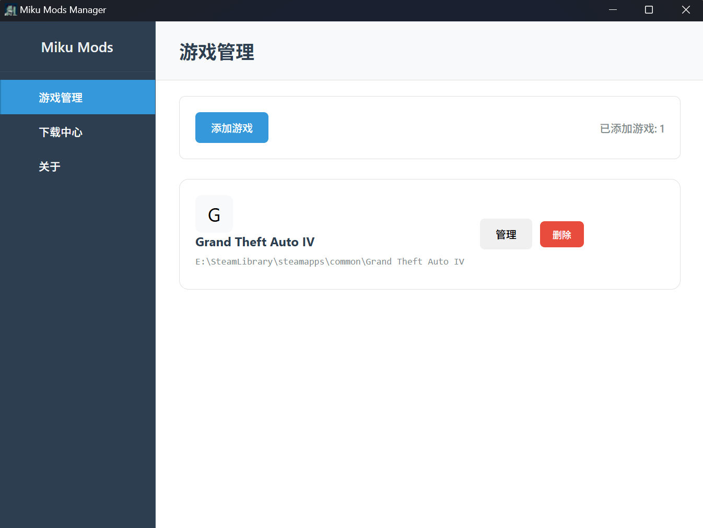
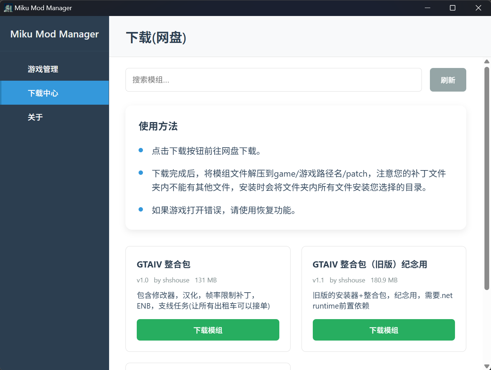

# MikuModManager
- 在安装游戏补丁或ENB时，您有没有遇到游戏无法打开，效果不喜欢，但是缺少恢复的手段？因为您的补丁文件已经嵌入了游戏文件中？
- 使用MikuModManager可以安全且简单的安装补丁，且在您的游戏遇到问题需要恢复时一键回滚到安装前状态！
- 程序不会产生垃圾文件，所有文件只会在exe同目录里！

## ✨ 功能特点

- **完全绿色**：无需安装即可使用，也不会在您的电脑上留下垃圾文件
- **游戏管理**：添加和管理多个游戏
- **补丁安装**：轻松安装和管理游戏补丁
- **备份回滚**：自动创建补丁安装备份，支持一键回滚
- **跨平台支持**：支持 Windows、macOS 和 Linux

## 后续更新
- 支持更复杂的模组导入，而不是只是复制并留档(计划实现类似OpenIV的功能)
- 更新多语言，目标是支持中文，英文，日文

  
  

## 📖 使用方法

### 添加游戏
1. 点击主界面上的「添加游戏」按钮
2. 输入游戏名称并选择游戏安装目录
3. 点击「添加游戏」按钮完成添加
### 安装补丁
1. 在游戏详情页面中，确保补丁已放置在 `game/[游戏名称]/patch/` 目录下
2. 选择要安装的补丁
3. 点击「安装选中补丁」按钮
### 回滚补丁
1. 在游戏详情页面中，选择要回滚到的备份
2. 点击「回滚到选中备份」按钮

## 💬 联系我

- 项目负责人: [shshouse](https://github.com/shshouse)
- Bilibili: [shshouse](https://space.bilibili.com/3493127123897196)
- 爱发电: [shshouse](https://afdian.com/a/shshouse)
- 反馈问题: [Issues](https://github.com/shshouse/MikuModsManager/issues)

## ❤️ 鸣谢

- [Vue.js](https://vuejs.org/)
- [TypeScript](https://www.typescriptlang.org/)
- [Tauri](https://tauri.app/)

---

如果您觉得这个项目有用，请给一个 ⭐️ 支持一下！
